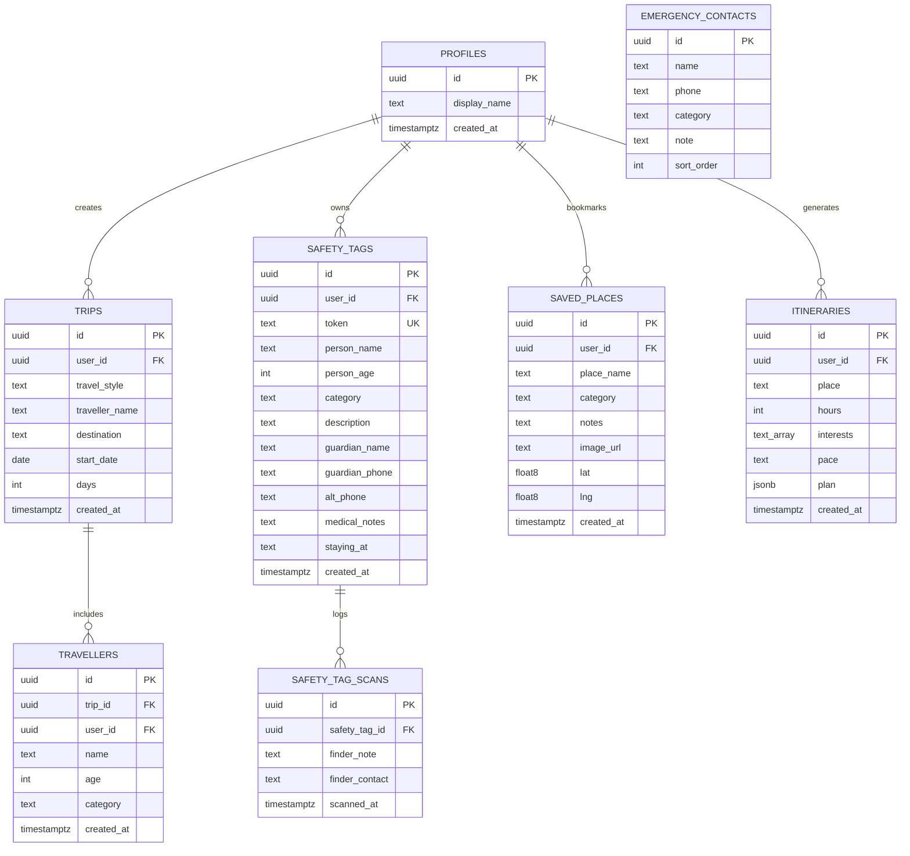

# Safr (Goa Guide Buddy) — Comprehensive Project & Technical Documentation

---

## 📌 Table of Contents
1. [Project Overview & Vision](#1-project-overview--vision)
2. [Complete Tech Stack Breakdown](#2-complete-tech-stack-breakdown)
3. [Database Architecture, Schema & RLS Policies](#3-database-architecture-schema--rls-policies)
4. [External APIs, Third-Party Services & Integrations](#4-external-apis-third-party-services--integrations)
5. [Algorithms, Mathematical Heuristics & Core Logic](#5-algorithms-mathematical-heuristics--core-logic)
6. [Core Features & Application Modules](#6-core-features--application-modules)
7. [UI/UX Design System, Typography & Animations](#7-uiux-design-system-typography--animations)
8. [Complete Dependency Breakdown (`package.json`)](#8-complete-dependency-breakdown-packagejson)
9. [Project Directory & File Structure](#9-project-directory--file-structure)
10. [Local Development, Environment Setup & Deployment](#10-local-development-environment-setup--deployment)

---

## 1. Project Overview & Vision

**Safr** (piloted in Goa, engineered for India) is a full-stack, AI-powered travel safety companion web application. It integrates real-time geospatial routing intelligence, crowd density estimation, safe-vs-fast route comparisons with turn-by-turn navigation, smart transport mode advice, 7-day marine and weather forecasts, automated AI itinerary planning, family QR safety wristbands with privacy-first notifications, live GPS radar tracking, and multi-lingual Indian language accessibility.

- **Application Name**: Safr (Goa Guide Buddy)
- **Author / Development Team**: Team KoS
- **Core Tagline**: *"Travel safer. Skip the trouble."*
- **Primary Domain**: Smart Tourism / Travel Tech / AI Safety Companion / Geospatial Navigation
- **Target Audience**: Solo travelers, families with children or senior citizens, backpackers, and international tourists exploring Goa.

---

## 2. Complete Tech Stack Breakdown

### **Frontend**:
| Technology | Version / Tool | Purpose & Usage |
| :--- | :--- | :--- |
| **Languages** | **TypeScript 5.8**, **TSX**, **HTML5**, **CSS3** | Complete end-to-end type safety, modern component templates, and reactive UI logic. |
| **UI Framework** | **React 19** (`v19.2.0`) | Declarative component rendering, concurrent rendering features, and reactive hooks. |
| **Build Tool & Bundler** | **Vite 8** (`v8.2.0`) | Lightning-fast Hot Module Replacement (HMR), optimized bundling, and client/server build pipelines. |
| **Routing** | **TanStack Router** (`v1.170.18`) | Type-safe, file-based routing with deep-link state management, search parameter validation, and SSR support. |
| **Server State Management** | **TanStack Query (React Query)** (`v5.101.1`) | Asynchronous data fetching, intelligent cache invalidation, background refetching, and optimistic UI mutations. |
| **Styling & CSS Architecture** | **Tailwind CSS v4** (`v4.2.1`), `tw-animate-css` | Atomic CSS with modern OKLCH color palettes, dark/light mode tokens, and custom keyframe animations. |
| **Component Primitives** | **Radix UI** (20+ primitives) | Accessible, unstyled UI primitives (Dialogs, Dropdowns, Popovers, Tooltips, Accordions, Tabs, Sliders, Separators). |
| **Interactive Maps** | **Leaflet** (`v1.9.4`) | Hardware-accelerated interactive maps, OpenStreetMap tile rendering, step markers, and polyline route drawing. |
| **QR Code Engine** | **QRCode.js** (`qrcode: ^1.5.4`) | High-resolution 2D matrix QR code generation for printable safety wristbands and tags. |
| **Icons & Visuals** | **Lucide React** (`lucide-react: ^0.575.0`), **Recharts** | Crisp vector icons, navigation maneuver indicators, weather flags, and interactive data visualization. |
| **Form Handling & Validation** | **React Hook Form** + **Zod** (`zod: ^3.24.2`) | High-performance uncontrolled form handling, strict runtime type assertion, and validation schemas. |
| **Toasts & Notifications** | **Sonner** (`sonner: ^2.0.7`) | Accessible, stacked toast notifications with animated status feedback. |

---

### **Backend & Server-Side**:
| Technology | Version / Tool | Purpose & Usage |
| :--- | :--- | :--- |
| **Languages** | **TypeScript**, **SQL / PL/pgSQL** | Typed server functions, API middleware, database triggers, and stored procedures. |
| **SSR & Fullstack Framework** | **TanStack Start** (`v1.168.32`) + **Nitro Server** (`v3.0-beta`) | Hybrid Server-Side Rendering (SSR) and RPC server functions (`createServerFn`) for direct server-to-client queries. |
| **Runtime Environment** | **Node.js** (v18+ / v20+) | High-performance asynchronous V8 JavaScript/TypeScript runtime. |
| **Error Resilience Layer** | Custom SSR Error Capture & Catastrophic Fallback Page | Prevents SSR crashes during network timeouts or database errors by gracefully falling back to clean static shells. |
| **AI Integration Layer** | **Vercel AI SDK** (`ai: ^7.0.58`, `@ai-sdk/google`, `@ai-sdk/openai-compatible`) | Structured schema-driven LLM prompt pipelines, fallback generation, and itinerary inference. |

---

## 3. Database Architecture, Schema & RLS Policies

### **Database Engine**: **PostgreSQL** hosted on **Supabase**
- **Client Library**: `@supabase/supabase-js` (`v2.112.2`)
- **Security Standard**: **Row Level Security (RLS)** is strictly enforced on all tables.
- **Authentication**: Supabase Auth (Email/Password, JWT sessions stored in `localStorage`, automated token refresh, auth guards).



### **Database Tables Breakdown**:

#### 1. `public.profiles`
Stores user profile records, automatically created via database trigger upon sign-up.
- `id` (`UUID`, Primary Key, Foreign Key -> `auth.users.id` ON DELETE CASCADE)
- `display_name` (`TEXT`)
- `created_at` (`TIMESTAMPTZ`, default: `now()`)
- *RLS Policies*:
  - `SELECT`: `auth.uid() = id`
  - `UPDATE`: `auth.uid() = id`
  - `INSERT`: `auth.uid() = id`

#### 2. `public.trips`
Stores active or planned trips configured by the user.
- `id` (`UUID`, Primary Key, default: `gen_random_uuid()`)
- `user_id` (`UUID`, Foreign Key -> `auth.users.id` ON DELETE CASCADE)
- `travel_style` (`TEXT`, e.g., `'solo'`, `'couple'`, `'family'`, `'group'`)
- `traveller_name` (`TEXT`)
- `destination` (`TEXT`, e.g., `'Panjim'`, `'Baga Beach'`)
- `start_date` (`DATE`)
- `days` (`INTEGER`, default: `1`)
- `created_at` (`TIMESTAMPTZ`, default: `now()`)
- *RLS Policies*: Restricted to owner (`auth.uid() = user_id`) for all operations.

#### 3. `public.travellers`
Stores individual family/group members associated with a trip.
- `id` (`UUID`, Primary Key, default: `gen_random_uuid()`)
- `trip_id` (`UUID`, Foreign Key -> `public.trips.id` ON DELETE CASCADE)
- `user_id` (`UUID`, Foreign Key -> `auth.users.id` ON DELETE CASCADE)
- `name` (`TEXT`)
- `age` (`INTEGER`)
- `category` (`TEXT`, `'adult'`, `'kid'`, `'senior'`)
- `created_at` (`TIMESTAMPTZ`, default: `now()`)
- *RLS Policies*: Restricted to owner (`auth.uid() = user_id`).

#### 4. `public.safety_tags`
Stores SafeTag QR registration records for vulnerable dependents (kids, elderly).
- `id` (`UUID`, Primary Key, default: `gen_random_uuid()`)
- `user_id` (`UUID`, Foreign Key -> `auth.users.id` ON DELETE CASCADE)
- `token` (`TEXT`, Unique, 6-character alphanumeric code or hex string)
- `person_name` (`TEXT`)
- `person_age` (`INTEGER`)
- `category` (`TEXT`, `'kid'`, `'senior'`, `'adult'`)
- `description` (`TEXT`)
- `guardian_name` (`TEXT`)
- `guardian_phone` (`TEXT`)
- `alt_phone` (`TEXT`)
- `medical_notes` (`TEXT`)
- `staying_at` (`TEXT`)
- `created_at` (`TIMESTAMPTZ`, default: `now()`)
- *RLS Policies*: Owner can perform full CRUD (`auth.uid() = user_id`).

#### 5. `public.safety_tag_scans`
Logs scan and finder notification events without leaking guardian PII.
- `id` (`UUID`, Primary Key, default: `gen_random_uuid()`)
- `safety_tag_id` (`UUID`, Foreign Key -> `public.safety_tags.id` ON DELETE CASCADE)
- `finder_note` (`TEXT`)
- `finder_contact` (`TEXT`)
- `scanned_at` (`TIMESTAMPTZ`, default: `now()`)
- *RLS Policies*:
  - `INSERT`: Open to anyone (`anon` and `authenticated`) so a Good Samaritan finder can submit alert details.
  - `SELECT`: Only the tag owner can read scan records for their registered tags.

#### 6. `public.saved_places` *(New)*
Stores user's liked destinations and travel bucket list.
- `id` (`UUID`, Primary Key, default: `gen_random_uuid()`)
- `user_id` (`UUID`, Foreign Key -> `auth.users.id` ON DELETE CASCADE)
- `place_name` (`TEXT NOT NULL`)
- `category` (`TEXT NOT NULL DEFAULT 'sight'`)
- `notes` (`TEXT`)
- `image_url` (`TEXT`)
- `lat` (`DOUBLE PRECISION`)
- `lng` (`DOUBLE PRECISION`)
- `created_at` (`TIMESTAMPTZ`, default: `now()`)
- *RLS Policies*: Restricted to owner (`auth.uid() = user_id`) for all CRUD operations.

#### 7. `public.itineraries`
Saves generated AI travel plans and schedules.
- `id` (`UUID`, Primary Key, default: `gen_random_uuid()`)
- `user_id` (`UUID`, Foreign Key -> `auth.users.id` ON DELETE CASCADE)
- `place` (`TEXT`)
- `hours` (`INTEGER`, default: `6`)
- `interests` (`TEXT[]`, e.g., `['Local food', 'History & heritage']`)
- `pace` (`TEXT`, `'relaxed'`, `'balanced'`, `'packed'`)
- `plan` (`JSONB`)
- `created_at` (`TIMESTAMPTZ`, default: `now()`)
- *RLS Policies*: Restricted to owner (`auth.uid() = user_id`).

#### 8. `public.emergency_contacts`
Pre-seeded public emergency directory for Goa.
- `id` (`UUID`, Primary Key, default: `gen_random_uuid()`)
- `name` (`TEXT`, e.g., `'Police 100'`, `'Ambulance 108'`, `'Drishti Marine Lifeguards'`)
- `phone` (`TEXT`)
- `category` (`TEXT`, `'Emergency'`, `'Police'`, `'Medical'`, `'Coastal'`, `'Travel'`, `'Support'`)
- `note` (`TEXT`)
- `sort_order` (`INTEGER`, default: `0`)
- *RLS Policies*: Publicly readable (`SELECT`) by all (`anon`, `authenticated`).

### **PostgreSQL Stored Procedures & Functions (PL/pgSQL)**:
- `handle_new_user()`: Trigger function that automatically creates a user row in `public.profiles` on user signup.
- `check_safety_tag(_token TEXT)`: **Zero-Knowledge privacy function** returning only `{ tag_id, category, is_active }`. Verifies that a tag exists without leaking guardian names, phone numbers, or addresses to strangers.
- `notify_safety_tag(_token TEXT, _finder_note TEXT, _finder_contact TEXT)`: Inserts a finder alert record into `safety_tag_scans` for the guardian's dashboard.
- `get_safety_tag(_token TEXT)`: Protected procedure for authenticated tag owners.

---

## 4. External APIs, Third-Party Services & Integrations

| API / Service | Endpoint / URL | Purpose & Implementation |
| :--- | :--- | :--- |
| **Komoot Photon Geocoding API** | `https://photon.komoot.io/api/?q=...` | High-speed OpenStreetMap-based geocoding and reverse geocoding for Goan landmarks; dynamic POI search for restaurants, beaches, viewpoints, and markets. |
| **OSRM (Open Source Routing Machine) API** | `https://router.project-osrm.org/route/v1/driving/...` | Calculates road driving routes, step-by-step turn maneuvers (`legs.steps`), leg summaries, distances, and Polyline / GeoJSON coordinates. |
| **Open-Meteo Weather API** | `https://api.open-meteo.com/v1/forecast?...` | Real-time weather, 7-day daily forecast (high/low temps, rain probability, UV index) and 24-hour hourly forecast. |
| **Wikipedia REST API** | `https://en.wikipedia.org/api/rest_v1/page/summary/...` | Fetches authentic cultural, historical, and geographical summaries for Goan tourist destinations. |
| **OpenStreetMap Tile Server** | `https://{s}.tile.openstreetmap.org/{z}/{x}/{y}.png` | Free open-source map tile imagery for the interactive Leaflet mapping client. |
| **Google Website Translator API** | `//translate.google.com/translate_a/element.js` | On-the-fly client-side website translation into 12+ Indian regional languages (Hindi, Marathi, Gujarati, Bengali, Telugu, Tamil, Kannada, Malayalam, etc.). |
| **HTML5 Geolocation API** | `navigator.geolocation` | Browser-level GPS tracking (`watchPosition` / `getCurrentPosition`) with high-accuracy coordinates. |
| **Google Maps & Apple Maps Navigation Linking** | `https://www.google.com/maps/dir/?api=1&origin=...` | 1-tap in-car / on-scooter live GPS turn-by-turn navigation launch. |
| **Supabase REST & RPC Engine** | PostgREST / GoTrue Auth APIs | Secure database queries, mutations, auth token lifecycle, and stored procedure executions. |

---

## 5. Algorithms, Mathematical Heuristics & Core Logic

### 1. **Safety-Scored Route Optimization & Turn-by-Turn Maneuver Formatting Algorithm**
Evaluates road safety and formats detailed turn-by-turn navigation instructions:
- **Base Score**: Initialized at `75`.
- **Highway / High-Speed Risk Penalty**: Uses regular expressions `/(NH ?\d+|national highway|bypass|ghat|hairpin)/i` on step maneuver summaries. If detected, penalizes the route by `-14` points.
- **Calm / Populated Road Bonus**: Matches `/(village|market|town|road through|main road)/i`. If matched, awards `+6` to `+10` points for well-lit, populated roads.
- **Detour Tolerance Heuristic**:
  - `detour = durationMin - fastestMin`.
  - Detours $\le 15$ mins: Awarded `+8` points as a lower-stress alternative.
  - Excessive detours $> 15$ mins: Penalized `-5` points.
- **Night-Travel Safety Heuristic**: If local travel time falls between 7:00 PM and 6:00 AM:
  - High-speed highway routes penalized an additional `-10` points.
  - Well-lit town routes awarded `+5` points.
- **Speed & Braking Distance Analysis**:
  - Computes $\text{avgSpeed} = \frac{\text{distanceKm}}{\text{durationMin}} \times 60$.
  - If $\text{avgSpeed} > 55\text{ km/h}$, penalizes by `-8` points; if $\le 50\text{ km/h}$, awards `+5` points.
- **Turn-by-Turn Instruction Parser**:
  - Maps raw OSRM maneuver types (`depart`, `arrive`, `turn`, `roundabout`, `fork`, `merge`, `ramp`) and direction modifiers (`left`, `right`, `slight left`, `sharp right`, `straight`) into clear human instructions with distance and duration per step.
  - Calculates geographic step coordinate locations to enable interactive map step pinpointing.

### 2. **Multi-Route Waypoint Generation Heuristic**
If the OSRM routing server returns fewer than 3 distinct route candidates, Safr calculates midpoint coordinate offsets:
$$\text{midLat} = \frac{\text{origin.lat} + \text{dest.lat}}{2} \pm 0.018$$
$$\text{midLng} = \frac{\text{origin.lng} + \text{dest.lng}}{2} \mp 0.018$$
It queries OSRM via these synthesized waypoints to generate reliable alternative and scenic detour routes.

### 3. **Beach & Marine Swimming Safety Flag Index**
Calculates real-time beach safety conditions for Goan beaches:
- **🔴 Red Flag (Hazardous / No Swimming)**: Wind speed $\ge 30\text{ km/h}$ or thunderstorm/severe weather ($code \ge 95$).
- **🟡 Yellow Flag (Caution / Lifeguard Zone Only)**: Wind speed $18 - 29\text{ km/h}$ or rain showers ($51 \le code \le 82$).
- **🟢 Green Flag (Safe for Swimming & Water Sports)**: Wind speed $< 18\text{ km/h}$ and calm skies.

### 4. **Smart Mode of Transport Recommendation Logic**
Analyzes destination topology and road characteristics:
- **Narrow Beach Alleys (Baga, Anjuna, Calangute)**: Recommends **Rental Scooter (Activa/Dio)** with parking tips and helmet safety enforcement notices.
- **Remote Hills & Waterfalls (Dudhsagar)**: Recommends **4x4 Forest Jeep Safari** + vehicle parking at Kolem.
- **Heritage Cities (Panjim, Old Goa, Fontainhas)**: Recommends **Walking & Heritage Strolls / Scooter** + Multi-level Car Parking guidance.
- **River Crossings & Islands (Divar, Chorao)**: Recommends **Free River Ferry (Ro-Ro)** with crossing schedules.
- **Long Distance / South Goa (Palolem, Agonda)**: Recommends **Self-Drive Rental Car or Cruiser Bike** with ghat driving precautions.

### 5. **AI Time-Budget Itinerary Scheduler**
- **Dynamic Time Math**: Converts start time ($H:M$) and total available duration ($T_{\text{hours}}$) to minute timelines (`formatTime12h`).
- **POI Candidate Fusion**: Blends curated Goan databases with live Photon geocoded POIs matching user-selected interests.
- **Pacing & Buffer Adjustments**: Allocates 30 to 120 minutes per stop, prevents duplicates via `Set`, and adds 15-minute travel buffers.

---

## 6. Core Features & Application Modules

1. **Intelligent Place Exploration & Transport Advisor (`/explore`)**:
   - Destination search with crowd percentage bands (*quiet*, *moderate*, *busy*, *packed*), best visit times, and alternative recommendations.
   - **Best Mode of Transport Card**: Recommends the optimal vehicle, estimated costs, parking ease, and road safety tips.
   - **Liked Places / Bucket List (❤️)**: 1-tap bookmarking to save places for future visits.
   - **"Get Directions"**: Instant pre-filled navigation routing to `/map`.
2. **Safe vs. Fast Map Routing & Turn-by-Turn Navigation (`/map`)**:
   - Compares routes with color-coded polylines on Leaflet (Fastest vs. Safer vs. Scenic Alternative).
   - **Turn-by-Turn Directions Panel**: Step-by-step instructions with maneuver icons, step distances, and interactive map step pin highlighting.
   - **1-Tap GPS Launch**: "Start GPS Navigation" button for Google Maps / Apple Maps.
3. **Overall Weather & Marine Safety Station (`WeatherWidget.tsx`)**:
   - Clickable weather station opening an interactive 7-day forecast modal.
   - 24-hour hourly temperature and rain probability timeline.
   - Drishti Marine Beach Swimming Safety Flag (Green/Yellow/Red flag indicators) and UV index advisory.
4. **Smart AI Itinerary Builder (`/itinerary`)**:
   - Builds custom minute-by-minute schedules for 1 to 24 hours based on pace, start time, and interest tags.
   - Direct "Directions" button on every stop to hop straight into navigation.
5. **Family QR Safety Tags (`/safety-tags`, `/find`, `/t/$token`)**:
   - Printable QR tags and short OTP codes for children and senior citizens.
   - Public Zero-Knowledge finder page allowing finders to alert the guardian without exposing private contact info.
6. **Live Family Tracking (`/live-tracking`)**:
   - Interactive map displaying user GPS coordinates alongside simulated or real family member locations with one-click call buttons.
7. **Goa Emergency Hub (`/emergency`)**:
   - One-tap calling to Police (100 / 112), Ambulance (108), Fire (101), Drishti Marine Beach Lifeguards, Tourist Police, and Women/Child Helplines.
8. **Universal Indian Languages Translator**:
   - Custom-integrated floating Google Translate widget supporting 12+ Indian regional languages.

---

## 7. UI/UX Design System, Typography & Animations

- **Color Space**: 100% **OKLCH** colors for perceptually uniform gradients and high-contrast dark/light mode switching.
- **Design Aesthetic**: Modern Glassmorphism (`backdrop-blur-xl`, semi-transparent card borders `border-border/50`), ambient glowing radial gradients, and fluid pill-shaped buttons.
- **Typography**: 
  - Sans-Serif: `"DM Sans"`, system-ui
  - Display / Headings: `"Fraunces"`, serif
- **Animations**: Custom Tailwind CSS animations (`animate-float`, `animate-float-slow`, `animate-sway`, `animate-pulse`, `animate-in fade-in slide-in-from-bottom`).

---

## 8. Complete Dependency Breakdown (`package.json`)

### **Production Dependencies (`dependencies`)**:
- `@ai-sdk/google` (`^1.0.12`): Google Gemini integration for Vercel AI SDK.
- `@ai-sdk/openai-compatible` (`^0.0.13`): OpenAI-compatible model provider support.
- `@hookform/resolvers` (`^3.9.1`): Zod resolver for React Hook Form.
- `@radix-ui/react-*` (20+ packages): Headless, accessible primitives (dialog, dropdown, popover, tabs, accordion, etc.).
- `@supabase/supabase-js` (`^2.112.2`): Client for Supabase database, auth, and storage.
- `@tailwindcss/vite` (`^4.2.1`): Tailwind CSS v4 Vite integration.
- `@tanstack/react-query` (`^5.101.1`): Server-state management and caching.
- `@tanstack/react-router` (`^1.170.18`): Type-safe routing engine.
- `@tanstack/react-start` (`^1.168.32`): Full-stack SSR framework.
- `ai` (`^7.0.58`): Vercel AI SDK core.
- `class-variance-authority` (`^0.7.1`): CVA component variant styling utility.
- `clsx` (`^2.1.1`) & `tailwind-merge` (`^3.0.1`): Conditional class composition.
- `cmdk` (`^1.0.4`): Fast command menu palette.
- `date-fns` (`^4.1.0`): Modern JavaScript date utility.
- `embla-carousel-react` (`^8.5.1`): Touch-enabled carousel.
- `input-otp` (`^1.4.1`): Accessible OTP input component.
- `leaflet` (`^1.9.4`): Interactive mapping client.
- `lucide-react` (`^0.575.0`): Modern SVG icon library.
- `qrcode` (`^1.5.4`): QR code rendering library.
- `react` & `react-dom` (`19.2.0`): React 19 core.
- `recharts` (`^2.15.0`): Charting library built on React components.
- `sonner` (`^2.0.7`): Toast notification system.
- `tailwindcss` (`^4.2.1`): Atomic CSS framework.
- `tw-animate-css` (`^1.1.2`): Extended CSS keyframe animations.
- `vaul` (`^1.1.1`): Mobile drawer primitive.
- `zod` (`^3.24.2`): TypeScript schema validation.

### **Development Dependencies (`devDependencies`)**:
- `@types/leaflet` (`^1.9.16`): TypeScript definitions for Leaflet.
- `@types/node` (`^22.10.1`): Node.js type definitions.
- `@types/qrcode` (`^1.5.5`): QR code type definitions.
- `@types/react` (`^19.0.0`) & `@types/react-dom` (`^19.0.0`): React 19 type definitions.
- `@vitejs/plugin-react` (`^4.3.4`): Fast Refresh plugin for Vite.
- `nitro` (`^3.0.0-beta.2`): Nitro server engine for SSR.
- `typescript` (`^5.8.2`): Static TypeScript compiler.
- `vite` (`^8.2.0`): Vite frontend bundler and dev server.

---

## 9. Project Directory & File Structure

```
Tourism Guide/
└── goa-guide-buddy-main/
    ├── .env                          # Supabase and API environment variables
    ├── package.json                  # Dependencies, scripts, and package metadata
    ├── vite.config.ts                # Vite plugins & configuration
    ├── tsconfig.json                 # TypeScript compiler options
    ├── components.json               # Shadcn / UI configuration
    ├── public/                       # Static public assets (icons, images)
    ├── supabase/
    │   ├── config.toml               # Supabase local configuration
    │   └── migrations/               # SQL schema definitions, RLS, triggers & RPCs
    │       ├── 20260811173101_*.sql  # Initial schema: tables, profiles, trips, tags
    │       ├── 20260815000000_*.sql  # Privacy fix: zero-knowledge tag lookup RPC
    │       └── 20260902000000_saved_places.sql # Saved places wishlist table
    └── src/
        ├── start.ts                  # TanStack Start client entry point
        ├── server.ts                 # Nitro SSR server entry & error recovery handler
        ├── router.tsx                # TanStack Router initialization
        ├── routeTree.gen.ts          # Auto-generated type-safe route tree
        ├── styles.css                # Tailwind v4 styles, OKLCH theme tokens & animations
        ├── components/
        │   ├── app-shell.tsx         # Responsive dashboard shell & navigation header
        │   ├── GoogleTranslate.tsx   # Floating Indian language translation dropdown
        │   ├── WeatherWidget.tsx     # 7-day forecast & marine safety flag modal widget
        │   └── ui/                   # Reusable Radix UI components (Button, Input, etc.)
        ├── hooks/
        │   └── use-mobile.tsx        # Responsive screen breakpoint detector hook
        ├── integrations/
        │   └── supabase/
        │       ├── client.ts         # Client-side Supabase client singleton
        │       ├── client.server.ts  # Server-side Supabase client instance
        │       ├── auth-middleware.ts# Auth middleware for protected server functions
        │       └── types.ts          # Auto-generated TypeScript database types
        ├── lib/
        │   ├── goa-schemas.ts        # Zod schemas for POIs, itineraries, transport & routes
        │   ├── goa.functions.ts      # Server functions for insights & AI itineraries
        │   ├── maps.server.ts        # Safe route scoring, turn-by-turn directions & navigation
        │   ├── maps.functions.ts     # Client RPC wrappers for map routing
        │   ├── utils.ts              # cn() Tailwind class merging utility
        │   ├── error-capture.ts      # SSR error capture handler
        │   └── error-page.ts         # Standalone HTML error page renderer
        └── routes/
            ├── __root.tsx            # Root HTML shell, QueryClientProvider & Toaster
            ├── index.tsx             # Hero landing page with animated Goa vibe
            ├── auth.tsx              # Sign-in & Sign-up page with email verification
            ├── find.tsx              # Public "Found someone? Enter OTP" lookup form
            ├── t.$token.tsx          # Public QR scan / Zero-Knowledge family alert page
            └── _authenticated/       # Protected routes (Requires signed-in session)
                ├── route.tsx         # Auth guard layout redirecting unauthenticated users
                ├── dashboard.tsx     # User trip summary & quick-action feature tiles
                ├── setup.tsx         # Multi-step trip planner & traveler configuration
                ├── explore.tsx       # Destination explorer, bucket list & transit advice
                ├── map.tsx           # Interactive map with turn-by-turn directions & GPS links
                ├── itinerary.tsx     # Time-budgeted AI travel itinerary with stop navigation
                ├── live-tracking.tsx # Real-time GPS & member simulation tracking map
                ├── safety-tags.tsx   # SafeTag QR code management & print center
                └── emergency.tsx     # Instant-dial Goa emergency contact directory
```

---

## 10. Local Development, Environment Setup & Deployment

### **Prerequisites**:
- Node.js (v18.0+ or v20.0+)
- npm, pnpm, or yarn
- A Supabase Project (with URL & Anon Key)

### **Environment Variables (`.env`)**:
Create a `.env` file in `goa-guide-buddy-main/` with:
```env
VITE_SUPABASE_URL="https://your-project.supabase.co"
VITE_SUPABASE_ANON_KEY="your-supabase-anon-key"
```

### **Running Locally**:
```bash
# 1. Install dependencies
npm install

# 2. Run database migrations on Supabase
# Run the SQL files in supabase/migrations/ in Supabase SQL editor

# 3. Start development server
npm run dev

# 4. Run TypeScript validation
npx tsc --noEmit
```
Application will be available at `http://localhost:3000` (or the port specified by Vite).
