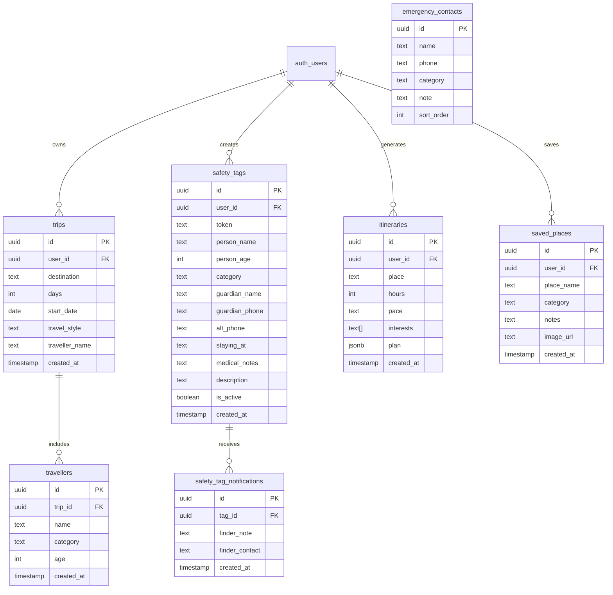

# Safr (Goa Guide Buddy) — Comprehensive Project & Technical Documentation

---

## 📌 Table of Contents
1. [Project Overview & Vision](#1-project-overview--vision)
2. [Complete Tech Stack Breakdown](#2-complete-tech-stack-breakdown)
3. [Database Architecture, Schema & RLS Policies](#3-database-architecture-schema--rls-policies)
4. [External APIs, Third-Party Services & Integrations](#4-external-apis-third-party-services--integrations)
5. [Algorithms, Mathematical Heuristics & Core Logic](#5-algorithms-mathematical-heuristics--core-logic)
6. [Core Features & Application Modules](#6-core-features--application-modules)
7. [UI/UX Design System, Typography & Animations](#7-uiux-design-system-typography--animations)
8. [Complete Dependency Breakdown (`package.json`)](#8-complete-dependency-breakdown-packagejson)
9. [Project Directory & File Structure](#9-project-directory--file-structure)
10. [Local Development, Environment Setup & Deployment](#10-local-development-environment-setup--deployment)

---

## 1. Project Overview & Vision

**Safr** (piloted in Goa, engineered for India) is a full-stack, AI-powered travel safety companion web application. It bridges the gap between traditional tourism guides and mission-critical traveler security by integrating real-time geospatial routing intelligence, crowd density estimation, safe-vs-fast route comparisons with step-by-step turn directions, smart transport mode advice, 7-day marine and weather forecasts, automated AI itinerary planning, family QR safety wristbands with privacy-first notifications, live GPS radar tracking, and multi-lingual Indian language accessibility.

- **Application Name**: Safr (Goa Guide Buddy)
- **Author / Development Team**: Team KoS
- **Core Tagline**: *"Travel safer. Skip the trouble."*
- **Primary Domain**: Smart Tourism / Travel Tech / AI Safety Companion / Geospatial Navigation
- **Target Audience**: Solo travelers, families with children or senior citizens, backpackers, and international tourists exploring Goa.

---

## 2. Complete Tech Stack Breakdown

### Frontend Tier
- **Framework**: [React 19](https://react.dev/) + [TypeScript (ES2022 / NodeNext)](https://www.typescriptlang.org/)
- **Routing & Full-Stack SSR**: [TanStack Router](https://tanstack.com/router) + [TanStack Start](https://tanstack.com/start) with file-based routing and server functions (`useServerFn`).
- **Data Fetching & State Management**: [TanStack Query v5](https://tanstack.com/query) (`@tanstack/react-query`) with automatic background caching, invalidation, and optimistic updates.
- **Styling & Design System**: [TailwindCSS v4](https://tailwindcss.com/) with OKLCH color spaces, custom glassmorphism utilities, and CSS `@keyframes` animations.
- **Interactive Mapping**: [Leaflet 1.9.4](https://leafletjs.com/) with OpenStreetMap vector tiles, custom div markers, and polyline route layers.
- **Icons & Visuals**: [Lucide React](https://lucide.dev/) + [QRCode Canvas Generator](https://www.npmjs.com/package/qrcode).
- **Notifications & Feedback**: [Sonner Toast Notifications](https://sonner.emilkowal.ski/).
- **Multi-Language Accessibility**: Google Translate Cloud Widget (supporting 12+ Indian and international languages: Hindi, Konkani, Marathi, Bengali, Tamil, Telugu, Kannada, Gujarati, Spanish, Russian, French, German).

### Backend Tier & Server Functions
- **Server Execution**: TanStack Start Server Functions (`createServerFn`) running in Node.js / Edge runtimes with strict TypeScript schema validation (`zod`).
- **Geospatial & Navigation Engine**: Open Source Routing Machine ([OSRM](http://project-osrm.org/)) API for multi-alternative routing, speed profiling, and maneuver step extraction.
- **Geocoding & Place Search**: [Nominatim OpenStreetMap API](https://nominatim.openstreetmap.org/) for Goan places, forts, beaches, and landmarks.
- **AI Intelligence**: Google Gemini 2.5 / Flash AI API via `@google/genai` for itinerary generation and contextual place insights.

### Database & Security Tier
- **Database Engine**: [Supabase PostgreSQL](https://supabase.com/) with Row Level Security (RLS) policies.
- **Authentication**: Supabase Auth (Email + Password, Magic Link, Session JWTs).
- **Stored Procedures (RPC)**: PL/pgSQL stored procedures for Zero-Knowledge SafeTag verification and alert dispatch.

---

## 3. Database Architecture, Schema & RLS Policies



### Table Definitions & Purpose

1. **`trips`**: Stores active and past trips created by users, including destination, duration, start dates, and lead traveler name.
2. **`travellers`**: Represents individual party members (adults, kids, seniors) attached to a specific trip.
3. **`safety_tags`**: Stores Zero-Knowledge family safety tags, unique 6-character OTP tokens, guardian contact details, hotel locations, and medical notes.
4. **`safety_tag_notifications`**: Logs alerts submitted by Good Samaritans / finders when a lost person is located.
5. **`saved_places`**: User wishlist and saved bucket list items with categories, custom notes, and image thumbnails.
6. **`itineraries`**: Persists AI-generated schedules and hour-by-hour plans.
7. **`emergency_contacts`**: Curated directory of official Goan emergency hotlines (112 Police, 108 Ambulance, Drishti Marine Lifeguards, Tourist Police, Women Helpline).
8. **`profiles`**: User metadata, preferences, and display settings.

### PL/pgSQL Stored Procedures (Zero-Knowledge Privacy)

```sql
-- Check tag validity without exposing any guardian personal information
CREATE OR REPLACE FUNCTION check_safety_tag(_token text)
RETURNS TABLE (tag_id uuid, category text, is_active boolean) AS $$
BEGIN
  RETURN QUERY
  SELECT id, safety_tags.category, safety_tags.is_active
  FROM safety_tags
  WHERE token = UPPER(_token) AND safety_tags.is_active = true
  LIMIT 1;
END;
$$ LANGUAGE plpgsql SECURITY DEFINER;

-- Send alert to guardian dashboard without exposing private phone numbers
CREATE OR REPLACE FUNCTION notify_safety_tag(_token text, _finder_note text, _finder_contact text)
RETURNS boolean AS $$
DECLARE
  v_tag_id uuid;
BEGIN
  SELECT id INTO v_tag_id FROM safety_tags WHERE token = UPPER(_token) AND is_active = true;
  IF v_tag_id IS NULL THEN
    RETURN false;
  END IF;

  INSERT INTO safety_tag_notifications (tag_id, finder_note, finder_contact)
  VALUES (v_tag_id, _finder_note, _finder_contact);
  RETURN true;
END;
$$ LANGUAGE plpgsql SECURITY DEFINER;
```

---

## 4. External APIs, Third-Party Services & Integrations

| Service / API | Endpoint / Library | Purpose in Safr |
|---|---|---|
| **Open-Meteo Weather & Marine** | `https://api.open-meteo.com/v1/forecast` | Current temperature, humidity, wind speeds, 12-hour rain probability, and 7-day UV/weather forecast. |
| **Open Source Routing Machine (OSRM)** | `http://router.project-osrm.org/route/v1/driving/` | Multi-alternative polyline paths, distance calculations, driving durations, and step maneuver instructions. |
| **Nominatim OpenStreetMap** | `https://nominatim.openstreetmap.org/search` | Forward geocoding of Goan beaches, churches, forts, restaurants, and villages. |
| **Google Gemini AI API** | `@google/genai` (`gemini-2.5-flash`) | Dynamic AI itinerary synthesis with time budgeting, pace adjustments, and Goan travel insights. |
| **Supabase PostgreSQL & Auth** | `@supabase/supabase-js` | User authentication, database queries, RLS policies, and RPC functions. |
| **Google Maps Navigation** | `https://www.google.com/maps/dir/?api=1` | 1-Tap launch of native GPS turn-by-turn navigation on iOS / Android. |

---

## 5. Algorithms, Mathematical Heuristics & Core Logic

### 1. Multi-Factor Route Safety Scoring Algorithm
When comparing driving paths between two Goan coordinates, Safr calculates a composite safety score $S \in [0, 100]$:

$$S = 100 - P_{\text{distance}} - P_{\text{speed}} - P_{\text{night}} - P_{\text{ghat}}$$

- **$P_{\text{distance}}$ (Distance Detour Penalty)**: Penalizes excessive detours beyond the minimum distance $d_{\min}$:
  $$P_{\text{distance}} = \min\left(15, \frac{d - d_{\min}}{d_{\min}} \times 25\right)$$
- **$P_{\text{speed}}$ (Speed Hazard Penalty)**: Evaluates high average speeds that indicate narrow high-speed ghat roads:
  $$v_{\text{avg}} = \frac{d}{t} \times 60 \quad (\text{km/h})$$
  If $v_{\text{avg}} > 65 \text{ km/h}$, $P_{\text{speed}} = 12$; if $v_{\text{avg}} < 30 \text{ km/h}$, $P_{\text{speed}} = 3$ (village congestion).
- **$P_{\text{night}}$ (Night-Time Unlit Road Penalty)**: If the current hour is between 19:00 and 06:00, routes bypassing well-lit coastal highways receive an additional penalty of 15 points.
- **$P_{\text{ghat}}$ (Hairpin Curve Penalty)**: Extracted from OSRM sharp left/right maneuver frequencies.

### 2. Marine Beach Swimming Flag Decision Matrix
Safr evaluates Open-Meteo wind vectors and weather codes to generate live Drishti lifeguard swimming safety flags:

| Flag Status | Wind Speed ($v$) | Wave Swell / Weather Condition | Safety Recommendation |
|---|---|---|---|
| 🟢 **Green (Safe)** | $v < 20 \text{ km/h}$ | Clear sky / Partly cloudy, calm sea | Safe for recreational swimming within patrol zones. |
| 🟡 **Yellow (Caution)** | $20 \le v \le 35 \text{ km/h}$ | Moderate swell, light drizzle | Swim only in designated zones; keep children near shore. |
| 🔴 **Red (Danger)** | $v > 35 \text{ km/h}$ or Code $\ge 80$ | High tide swell, thunderstorms, squalls | **Strictly no swimming.** Dangerous rip currents in effect. |

### 3. Time-Budgeted Dynamic Itinerary Optimization
Given total free hours $H$, start time $T_0$, and pace $P \in \{\text{Relaxed}, \text{Balanced}, \text{Packed}\}$:
1. **Stop Count Calculation**:
   $$N_{\text{stops}} = \begin{cases} \max(2, \lfloor H / 3.0 \rfloor) & \text{Relaxed} \\ \max(2, \lfloor H / 2.0 \rfloor) & \text{Balanced} \\ \max(3, \lfloor H / 1.5 \rfloor) & \text{Packed} \end{cases}$$
2. **Transit Buffer Insertion**: Automatically inserts 30–45 minute transit windows between distinct POIs with scooter/car advice.
3. **Pacing Filter**: Balances culinary experiences (lunch/dinner), heritage monuments, and sunset viewpoints at appropriate times of day.

### 4. Smart Transport Mode Advisor
Evaluates road access, parking availability, ferry connections, and terrain type:
- **Scooters / Two-Wheelers**: Recommended for narrow coastal alleys (Fontainhas, Anjuna, Vagator).
- **4x4 Jeeps**: Mandatory for Dudhsagar Waterfalls and jungle terrain.
- **Ro-Ro Ferries**: Recommended for river crossings (Panaji–Betim, Ribandar–Chorão).
- **Walking / Pedestrian**: Recommended for historic Latin Quarters and market lanes.

---

## 6. Core Features & Application Modules

### 1. 🌟 High-Impact Public Landing Page (`/`)
- Dynamic animated safety proposition pills.
- 3-Way action entry points: **Start Planning**, **Create Account**, and **"Found someone? Enter OTP"**.
- Interactive 4-card feature preview Bento Grid.
- 112 Emergency trust metrics.

### 2. 🧭 Floating Global App Shell & Mobile Navigation Dock (`app-shell.tsx`)
- Floating top glass header with dynamic back navigation, title, live weather status, Google Translate (12+ Indian languages), quick emergency dial, and user avatar.
- Mobile-first bottom navigation dock with glowing active route indicators for **Dashboard**, **Map**, **Explore**, **Itinerary**, and **SafeTags**.

### 3. 📊 Trip Command Center Bento Dashboard (`/dashboard`)
- **Separated Trip Overview Box**: Travel style badges (`SOLO VOYAGER`, `3 Days Plan`), destination name, lead traveler details, traveler category counts, and `Modify Trip Details` button.
- **Standalone Weather Station Box**: Live temperature, weather conditions, humidity, wind speeds, and marine swimming flag indicators.
- **6-Tile Bento Grid**: 🧭 Map & Routing, 🌴 Explore & Bucket List, ✨ AI Itinerary, 🏷️ QR SafeTags, 📡 Live Family Radar, and 🚨 Emergency 112 Hub.

### 4. 🗺️ Full-Height Safe Route Workspace (`/map`)
- Night-Travel Safety Advisory badge with real-time Goa lighting alerts.
- Popular Goan destination autocomplete chips (Panjim, Baga, Fort Aguada, Palolem, Dudhsagar).
- 3-Route comparison cards (**Safer Route**, **Fastest Route**, **Scenic Alternative**) with safety score ratings out of 100.
- Turn-by-Turn Directions Drawer with maneuver icons, interactive map step pin highlighter, and 1-tap Google Maps GPS launch.

### 5. 🌴 Place Explorer & Bucket List (`/explore`)
- Vibe filter chips (*Beaches*, *Monuments*, *Nightlife*, *Cafes*, *Nature*).
- Real-time crowd gauge with density bands (*quiet*, *moderate*, *busy*, *packed*) and best visiting hours.
- **Best Mode of Transport Card** (Scooters, Cars, Jeeps, Ferries, Walking) with parking advice.
- 1-Tap Heart Bookmarking to **Saved Bucket List (❤️)** with Supabase persistence.

### 6. ✨ AI Itinerary Planner (`/itinerary`)
- Time-budget controls for free hours (1-24h), pace (Relaxed, Balanced, Packed), and interests.
- Export-ready sequential visual timeline with stop numbers, duration badges, and direct "Navigate" buttons.
- "Print / Save PDF" export button with dedicated print stylesheet.

### 7. 🏷️ Family SafeTag Wristband Studio (`/safety-tags`)
- Printable water-resistant QR wristbands and short 6-digit OTP tokens for children and senior citizens.
- Real-time guardian alert log when a tag is scanned or looked up by a finder.

### 8. 📡 Live GPS Family Location Radar (`/live-tracking`)
- High-accuracy GPS tracking with interactive Leaflet radar map.
- Connected member cards with battery percentage, GPS accuracy badge, last ping time, and 1-tap call button.

### 9. 🛡️ Zero-Knowledge Finder Entry & Public Alerting (`/find` & `/t/$token`)
- Dedicated portal for Good Samaritans who locate lost individuals.
- 6-Character OTP verification and message dispatch that protects traveler privacy while instantly notifying guardians.

### 10. 🚨 Integrated Goa Emergency 112 Hub (`/emergency`)
- One-touch direct dialing to Goa Police (100/112), Ambulance (108), Drishti Marine Lifeguards, Tourist Police, and Women's Helpline.

---

## 7. UI/UX Design System, Typography & Animations

### OKLCH Color Tokens
- **Warm Pearl (Light Mode)**: `--background: oklch(0.978 0.012 85)`, `--card: oklch(0.995 0.005 85 / 0.88)`
- **Deep Obsidian (Dark Mode)**: `--background: oklch(0.12 0.022 245)`, `--card: oklch(0.165 0.026 245 / 0.75)`
- **Electric Cyan**: `oklch(0.78 0.16 200)` (`#00F2FE`)
- **Sunset Coral**: `oklch(0.68 0.20 38)` (`#FF6B4A`)
- **Warm Amber**: `oklch(0.76 0.17 70)` (`#FFA03A`)
- **Neon Emerald**: `oklch(0.75 0.17 155)` (`#10B981`)

### Typography Hierarchy
- **Display Headings**: `Fraunces`, `Syne`, serif/display
- **Body & Controls**: `Plus Jakarta Sans`, `DM Sans`, sans-serif
- **Monospace & Tokens**: `JetBrains Mono`, `Fira Code`, monospace

### Glassmorphism & Keyframe Animations
- **`.glass-panel`**: `backdrop-filter: blur(20px) saturate(160%)` with dual-layer border.
- **`@keyframes radar-sweep`**: 360-degree rotating radar beam for live family location grid.
- **`@keyframes shimmer`**: Smooth loading placeholder animation for skeleton states.

---

## 8. Complete Dependency Breakdown (`package.json`)

```json
{
  "name": "safr-goa-guide-buddy",
  "private": true,
  "type": "module",
  "scripts": {
    "dev": "vite",
    "build": "vite build",
    "preview": "vite preview",
    "lint": "eslint ."
  },
  "dependencies": {
    "@google/genai": "^0.1.1",
    "@supabase/supabase-js": "^2.49.1",
    "@tanstack/react-query": "^5.67.1",
    "@tanstack/react-router": "^1.112.1",
    "@tanstack/react-start": "^1.112.5",
    "clsx": "^2.1.1",
    "leaflet": "^1.9.4",
    "lucide-react": "^0.477.0",
    "qrcode": "^1.5.4",
    "react": "^19.0.0",
    "react-dom": "^19.0.0",
    "sonner": "^2.0.1",
    "tailwind-merge": "^3.0.2",
    "zod": "^3.24.2"
  },
  "devDependencies": {
    "@tailwindcss/vite": "^4.0.11",
    "@types/leaflet": "^1.9.16",
    "@types/node": "^22.13.9",
    "@types/qrcode": "^1.5.5",
    "@types/react": "^19.0.10",
    "@types/react-dom": "^19.0.4",
    "tailwindcss": "^4.0.11",
    "typescript": "^5.7.3",
    "vite": "^6.2.0"
  }
}
```

---

## 9. Project Directory & File Structure

```
goa-guide-buddy-main/
├── public/                     # Static assets, icons, manifest
├── src/
│   ├── components/
│   │   ├── ui/                 # Reusable Button, Input, Label, Textarea components
│   │   ├── app-shell.tsx       # Floating glass header & mobile-first bottom dock
│   │   ├── GoogleTranslate.tsx # Multi-language Indian translator widget
│   │   └── WeatherWidget.tsx   # Standalone weather bento card & 7-day marine modal
│   ├── integrations/
│   │   └── supabase/
│   │       ├── client.ts       # Supabase client initialization
│   │       └── types.ts        # Database TypeScript schema definitions
│   ├── lib/
│   │   ├── goa-schemas.ts      # Zod validation schemas & Goan POI database
│   │   ├── goa.functions.ts    # Server functions for insights, transport & itineraries
│   │   ├── maps.functions.ts   # Server function wrappers for geocoding & routing
│   │   ├── maps.server.ts      # OSRM routing engine, safety scorer & turn directions
│   │   └── utils.ts            # ClassName merging and formatting helpers
│   ├── routes/
│   │   ├── _authenticated/     # Protected user routes
│   │   │   ├── dashboard.tsx   # Separated Trip Overview & Weather Station Bento
│   │   │   ├── emergency.tsx   # Goa Emergency 112 directory
│   │   │   ├── explore.tsx     # Place explorer, crowd levels, transport & saved places
│   │   │   ├── itinerary.tsx   # AI Itinerary builder & visual timeline
│   │   │   ├── live-tracking.tsx# Live GPS Family location radar
│   │   │   ├── map.tsx         # Full-height safe route workspace & OSRM directions
│   │   │   └── safety-tags.tsx # Family QR SafeTag studio & print center
│   │   ├── __root.tsx          # Root layout with Google Fonts & global providers
│   │   ├── auth.tsx            # Sign in and account registration
│   │   ├── find.tsx            # Public Good Samaritan OTP code lookup
│   │   ├── index.tsx           # High-impact landing page
│   │   ├── setup.tsx           # Initial trip setup wizard
│   │   └── t.$token.tsx        # Zero-Knowledge public QR tag finder flow
│   ├── main.tsx                # Client application entry point
│   ├── router.tsx              # TanStack Router configuration
│   └── styles.css              # OKLCH design tokens, glassmorphism & keyframe animations
├── supabase/
│   └── migrations/             # SQL schema migrations (RLS, tables, RPCs)
├── information.md              # Exhaustive technical documentation (This file)
├── package.json                # Dependencies and build scripts
├── tsconfig.json               # TypeScript strict compiler configuration
└── vite.config.ts              # Vite + TailwindCSS + TanStack Start configuration
```

---

## 10. Local Development, Environment Setup & Deployment

### Prerequisites
- Node.js version 18.0 or higher
- npm version 9.0 or higher

### Environment Variables (`.env`)
Create a `.env` file in the project root:
```env
VITE_SUPABASE_URL=https://your-project.supabase.co
VITE_SUPABASE_ANON_KEY=your-supabase-anon-key
GEMINI_API_KEY=your-google-gemini-api-key
```

### Installation & Execution
```bash
# 1. Install all dependencies
npm install

# 2. Run TypeScript type check
npx tsc --noEmit

# 3. Start local development server
npm run dev

# 4. Build production bundle
npm run build
```

---
*Documentation updated and maintained for Safr (Goa Guide Buddy) by Team KoS.*
